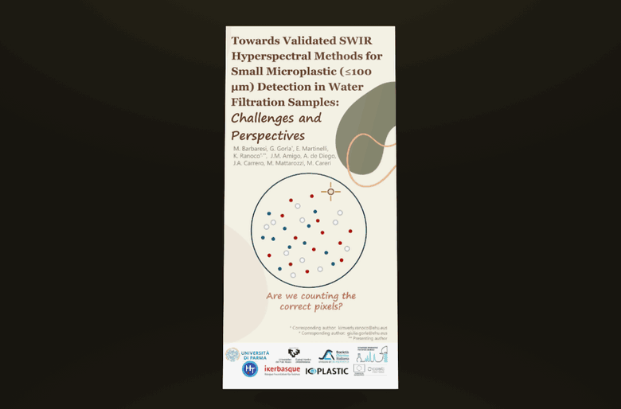

# Micro2026 — Take-Home Flyer

An unfoldable, shareable version of the Micro2026 trifold flyer:

**Towards Validated SWIR Hyperspectral Methods for Small Microplastic (≤100 µm) Detection in Water Filtration Samples: Challenges and Perspectives**
M. Barbaresi, G. Gorla\*, E. Martinelli, K. Ranoco\*\*\*, J. M. Amigo, A. de Diego, J. A. Carrero, M. Mattarozzi, M. Careri

**Live:** https://kimvrnc.github.io/Micro2026Presentation/

One link, two things: the **flyer** and the **walking talk**.

**Flyer.** The sheet behaves like paper. The front cover swings open, then the
tucked flap unfolds, exactly as the printed trifold does.

* On a touch screen, **tap anywhere** to walk the sheet through what your
  hands would do: open the cover, unfold the flap, turn it over, close it.
  The button always names the next step. With a mouse, drag or use the slider.
* The magnifier reads any panel at 600 dpi, with zoom and pan (clicking a
  panel does the same on a desktop, where dragging is easy anyway)
* The turn-over button shows the other side of the sheet at any fold angle
* Keyboard: `←` `→` fold · `F` turn over · `R` read · `Esc` close

**Walking talk.** All 18 slides, arrow keys or swipe, a thumbnail strip to jump around,
and click-to-zoom into any figure at the slide's native 3840 px.

* **Present mode** fills the screen and advances on a tap — the left edge
  goes back. It hides the page's own chrome with CSS and asks for real
  fullscreen on top where the browser has the API, so it behaves the same
  on iOS, which offers no fullscreen for a page.
* Keyboard: `←` `→` `Space` page · `P` present · `R` zoom · `1` `2` switch view
* `#talk` in the URL opens straight on the slides

The five authors with LinkedIn profiles are linked from the header and from
the info panel.

**The walking talk PDF carries no speaker notes.** A PowerPoint PDF export writes the
slides only; notes live in a separate part of the file. This is verified rather
than assumed — the build checks every phrase of all 12 notes slides against the
text of the produced PDF.

## Panel map

The source is a two-slide A4 landscape deck (29.7 × 21 cm) using the standard
letter-fold imposition — equal thirds of 9.9 cm:

| Sheet | Left | Middle | Right |
|---|---|---|---|
| Slide 1 — outside | `o1` inside flap (SWIR-HSI Analysis) | `o2` back cover (Summary of Decisions) | `o3` **front cover** |
| Slide 2 — inside | `i1` One Pixel ≠ One Pure Spectrum | `i2` No Single Preprocessing Recipe | `i3` Pixel ≠ Particle |

Folded, the left third carries the front cover over the middle, and the right
third tucks the flap underneath it. That is why the cover opens first and the
flap second.

## Why the images are sharp

The panels are cut from a **600 dpi export made by PowerPoint itself**, with
automatic picture compression switched off, so the embedded figures keep their
native resolution (up to 2880 px) and the text is set in the real fonts —
Ebrima, Segoe Print, Gill Sans Nova Cond — which only exist on the authoring
machine.

A PDF exported from PowerPoint with default settings downsamples every figure to
roughly 200 dpi; that is the clarity loss this version avoids.

Each panel ships in two tiers: a light one that drives the fold animation, and a
600 dpi one loaded on demand for the reader.

## Rebuilding the assets

1. Run `export_web.ps1` on the Windows machine that has the decks. It disables
   picture compression, then exports the flyer at 7016 × 4961, the walking talk's
   18 slides at 3840 × 2160, and a PDF of each.
2. `build_assets.py` slices each flyer sheet into equal thirds and writes the
   WebP tiers into `assets/panels/`.
3. `build_talk.py` writes the slide tiers into `assets/talk/` — `th` 320 px for
   the strip, `view` 1920 px for reading, `hi` 3840 px fetched only on zoom.

All three are kept in `tools/`. Note that PowerShell's COM binder rejects
`ExportAsFixedFormat`'s optional arguments on some Office builds, so the script
uses `SaveCopyAs(ppSaveAsPDF)` and falls back; every step is wrapped so one
failure cannot abort the run.

Initial page load is about 1 MB. The 600 dpi flyer panels and the 3840 px
slides are fetched only when someone zooms.
